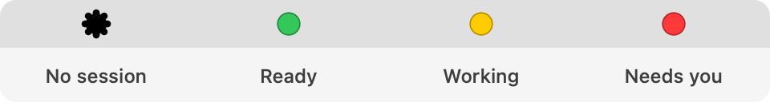

<p align="center">
  
</p>

<h1 align="center">Claude Status Light</h1>

<p align="center">
  A tiny macOS menu bar light that shows what <b>Claude Code</b> is doing,<br>
  so you can stop checking the terminal.
</p>

<p align="center">
  <a href="https://github.com/urm1n/claude-status/releases/latest"></a>
  <a href="https://github.com/urm1n/claude-status/actions/workflows/ci.yml"></a>
  
  <a href="LICENSE"></a>
</p>

<p align="center">
  <picture>
    <source media="(prefers-color-scheme: dark)" srcset="docs/images/states-dark.png">
    
  </picture>
</p>

Start a long task in Claude Code, switch to something else, and glance at the menu bar:

- 🟢 **Green**: Claude is done and waiting for your next prompt
- 🟡 **Yellow**: Claude is working
- 🔴 **Red**: Claude needs you (a permission prompt, a question, a form)
- ⚪ **Gray ring**: no Claude Code session is open

You also get a notification when Claude **finishes** or **needs you**. Click it to jump back to the right terminal or editor.

**Why you might like it**

- **Set up in one click.** No account, no API key, no config files to edit.
- **Light.** About 13 MB of memory, 0% CPU while idle, and an app of under 3 MB.
- **Private.** It never touches the network and never reads your prompts or code.
- **Works everywhere Claude Code does:** Terminal, iTerm, Ghostty, Warp, VS Code, Cursor, and the Claude desktop app's Code tab.
- **Handles several sessions at once.** The light shows the most urgent one, and the menu lists them all.

---

## Install

### Option 1: Download the app (easiest)

1. Download **[ClaudeStatusLight.dmg](https://github.com/urm1n/claude-status/releases/latest/download/ClaudeStatusLight.dmg)** from the [latest release](https://github.com/urm1n/claude-status/releases/latest).
2. Open the DMG and drag **Claude Status Light** into **Applications**.
3. Open it from Applications. The first time, macOS will block it (see below).

> [!IMPORTANT]
> **First launch: "Apple could not verify…"**
>
> The app is free and open source but isn't notarized by Apple (that needs a paid developer account), so macOS asks you to confirm once:
>
> 1. Try to open the app, then click **Done** on the warning.
> 2. Open **System Settings → Privacy & Security**, scroll down, and click **Open Anyway** next to "Claude Status Light".
> 3. Confirm with your password. You won't be asked again.
>
> Or run this once in Terminal and then open the app normally:
> ```bash
> xattr -dr com.apple.quarantine "/Applications/Claude Status Light.app"
> ```

### Option 2: Build it yourself

Needs the Xcode Command Line Tools (`xcode-select --install`).

```bash
git clone https://github.com/urm1n/claude-status.git
cd claude-status
./install.sh
```

This builds the app, puts it in `/Applications` and opens it. You don't get a Gatekeeper warning, because you built it yourself.

## Set it up (one click)

1. When the app opens, it asks: **"Connect Claude Status Light to Claude Code?"** Click **Install Hooks**.
2. When macOS asks, **Allow** notifications. If you miss the prompt, the menu shows **Turn On Notifications…**.
3. **Restart any Claude Code sessions that are already open** (or just start a new one).

That's it. The light turns green as soon as a session starts.

Optional: open the menu and turn on **Launch at Login**.

> Missed the prompt? Click the light in the menu bar and choose **Install Hooks…**.

## Using it

**Click the light** to see every session, with its folder, its state and how long it has been in that state. Click a session to bring its terminal or editor to the front.

From the same menu you can turn notifications on or off, toggle Launch at Login, install or uninstall the hooks, and open **Settings…**:

| Setting | What it does |
|---|---|
| Colors | Pick your own color for each state |
| Different shape per state | Accessibility mode for color blindness (see below) |
| Show light when no session | Hide the gray ring when Claude isn't running |
| Notifications | On/off for "finished" and "needs you", a sound for each, or silent |
| Only if Claude worked at least… | Skip "finished" notifications for quick answers |
| Skip when terminal is in front | No notification if you're already looking at that session |
| Idle timeout | How long a silent "working" session waits before it's treated as ready (default 5 min) |

<details>
<summary>Accessibility mode (shapes as well as colors)</summary>
<br>
<picture>
  <source media="(prefers-color-scheme: dark)" srcset="docs/images/states-symbols-dark.png">
  
</picture>
</details>

### Notifications that clean up after themselves

Each session gets **one** notification slot. A new notification replaces the old one, and it disappears when Claude gets back to work, when you send a new prompt, or when the session ends. Notification Center never fills up with stale alerts.

## Troubleshooting

<details>
<summary><b>The light stays gray while Claude is running</b></summary>

- Click the light. If it says **Hooks not installed**, click **Install Hooks…**.
- Sessions only pick up the hooks when they start, so **restart Claude Code**.
- Check from Terminal: `~/.claude-status-light/bin/csl-hook status` should print `installed`.
- When a session is active, a file appears in `~/.claude-status-light/sessions/`.
</details>

<details>
<summary><b>I don't get notifications</b></summary>

- If macOS is blocking them, the menu shows **Notifications are off in macOS**. Click **Turn On Notifications…** and switch on **Allow notifications** on the page that opens.
- **Settings → Notifications → Send Test** shows whether notifications get through.
- A Focus mode (Do Not Disturb) hides banners.
- In the app's menu, **Notifications** must be checked. In Settings, check the per-type toggles and the "skip when terminal is in front" option.
</details>

<details>
<summary><b>I get two notifications for everything</b></summary>

Another tool has also hooked into Claude Code (for example a "notifier" script that uses `terminal-notifier`). Remove its entries from the `"hooks"` section of `~/.claude/settings.json`, or turn off notifications in one of the two tools.
</details>

<details>
<summary><b>The light was stuck on yellow after I pressed Esc</b></summary>

Claude Code doesn't report a turn ending when you interrupt it. The light corrects itself after about 60 seconds, when Claude Code reports it's waiting for input. If it doesn't, it goes back to green after the idle timeout (Settings → Sessions).
</details>

<details>
<summary><b>I can't see the light at all</b></summary>

- On a MacBook with a notch, a crowded menu bar can hide icons behind the notch. Try quitting another menu bar app, or use a tool like Ice or Bartender.
- If you turned off **Show the light when no session is running**, it only appears while Claude is running. Open the app again from Applications to get to Settings.
</details>

<details>
<summary><b>Does it slow Claude Code down?</b></summary>

No. Each hook call takes about 10 ms, never blocks Claude, prints nothing, and always reports success. It keeps working the same way even if the app is quit or deleted.
</details>

## Privacy

- **No network access at all.** No analytics, no update checks, no accounts.
- It stores only what it needs to draw the light: session id, project folder, state, a short reason ("Permission needed: Bash"), timestamps and process ids.
- It **never** stores your prompts, code, tool inputs or Claude's replies. The hook ignores those fields.
- It only changes `~/.claude/settings.json` when you click Install or Uninstall. It backs the file up first, only adds its own entries, and leaves everything else exactly as it was.

More detail in **[How it works](docs/how-it-works.md)**.

## Uninstall

1. Click the light → **Uninstall Hooks…** (this restores your Claude settings exactly)
2. Quit the app and drag `/Applications/Claude Status Light.app` to the Trash
3. Optional: delete `~/.claude-status-light`

## Contributing

Bug reports, ideas and pull requests are welcome. See **[CONTRIBUTING.md](CONTRIBUTING.md)**. The original spec is in [docs/requirements.md](docs/requirements.md).

## License

[MIT](LICENSE). Not affiliated with Anthropic. "Claude" and "Claude Code" are Anthropic's names for their products.
