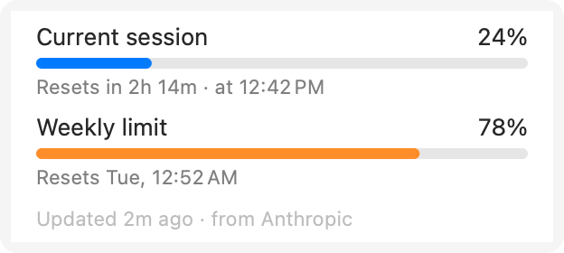
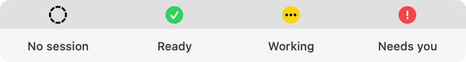

# User guide

- [The menu](#the-menu)
- [Notifications](#notifications)
- [Usage limits](#usage-limits)
- [Settings](#settings)
- [Updating](#updating)

## The menu

Click the light in the menu bar to see:

- **Usage limits:** session (5-hour) and weekly usage, with when each resets ("Resets in 4h 22m · at 2:34 PM"). Bars turn orange at 75% and red at 90%.
- **Sessions:** every open Claude Code session, with its folder, state, and how long it has been in that state. Click one to bring its terminal or editor to the front.
- **Notifications** and **Launch at Login** switches, **Settings…**, and **Uninstall Hooks…**

## Notifications

| When | Example | Sound |
|---|---|---|
| Claude finishes a turn | *Claude finished · my-project · 2m 13s* | Hero |
| Claude needs you | *Claude needs you · my-project: Permission needed: Bash* | Ping |
| A usage limit is 90% used | *Session limit 90% used · 10% left · resets in 1h 12m at 2:34 PM* | Ping |

- Each session has one notification slot. A new notification replaces the old one, and it clears itself once Claude gets back to work or you reply.
- Click a notification to jump to that session's terminal or editor.
- The limit warning comes once per limit, each time the limit resets.
- To check that notifications get through, use **Settings → Notifications → Send Test**.

## Usage limits

  <picture>
    <source media="(prefers-color-scheme: dark)" srcset="images/usage-dark.png">
    
  </picture>

Usage limits need a Claude **Pro** or **Max** plan. They're the same numbers Claude Code's `/usage` command shows.

| Where you use Claude Code | How usage gets to the app |
|---|---|
| Terminal | Automatically, after each reply, through Claude Code's status line. Works offline. |
| VS Code, Cursor, other editors | Click the light and choose **Show Usage from Anthropic…** (or turn on **Fetch usage from Anthropic** in Settings). The app asks Anthropic for the same numbers using the login Claude Code already saved: no extra login, no prompts. It refreshes every 5 minutes while a session is open. |

To see your session usage at a glance, turn on **Show session usage % next to the light** in Settings.

> In the terminal, the app adds a short status line such as `Session 24% · resets 2h 13m   Week 41%`. If you already had your own status line, it keeps showing it instead.

> Usage fetching uses an endpoint Anthropic doesn't document, so it could stop working if they change it. The terminal source would keep working.

## Settings

Click the light and choose **Settings…**.

| Setting | Default | What it does |
|---|---|---|
| Colors | Green, yellow, red | Choose the color for each state |
| Different shape per state | Off | Accessibility mode: ✓, •••, ! instead of colored flowers |
| Spin the light while Claude is working | On | Turns off automatically with Reduce Motion |
| Show the light when no session is running | On | Hides the plain flower when Claude isn't running |
| Notifications | On | Turn "finished" and "needs you" on or off, and pick a sound for each |
| Only if Claude worked at least… | Every turn | Skip "finished" for quick answers |
| Skip when that session's terminal is in front | Off | No notification if you're already looking at it |
| Show session usage % next to the light | Off | Shows e.g. `23%` beside the light |
| Warn when a limit is 90% used | On | One notification per limit per period |
| Fetch usage from Anthropic | Off | Usage limits for VS Code and other editors |
| Idle timeout | 5 min | A "working" session with no activity this long counts as ready |
| Launch at login | Off | Start with your Mac |

Accessibility mode preview

 
<picture>
  <source media="(prefers-color-scheme: dark)" srcset="images/states-symbols-dark.png">
  
</picture>

## Updating

1. Download the [latest ClaudeStatusLight.dmg](https://github.com/urm1n/claude-status/releases/latest/download/ClaudeStatusLight.dmg).
2. Quit the app (click the light and choose **Quit**), then drag the new version into Applications and replace the old one.
3. Open it. If macOS blocks it, follow the [first-launch steps](troubleshooting.md#apple-could-not-verify-on-first-launch) again.
4. Restart open Claude Code sessions.

Your settings are kept, and the app updates its hooks by itself. See what's new in the [changelog](../CHANGELOG.md).

If you built from source, run `git pull && ./install.sh`.
